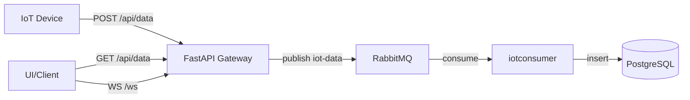

# Architecture

## What This Is

Project One is an IoT ingestion pipeline with:

- HTTP ingestion API (`gateway`)
- Message queue (`rabbitmq`)
- Async processor (`iotconsumer`)
- Persistent storage (`postgres`)
- Shared model/sensor package (`commonpackages`)

## Component Roles

- `gateway`: receives device payloads via `POST /api/data`, pushes messages to queue.
- `iotconsumer`: reads from queue `iot-data`, stores records in Postgres.
- `commonpackages`: shared SQLAlchemy model (`DataRecord`) and sensor classes.
- `postgres`: stores `data_records`.
- `rabbitmq`: decouples API ingestion from DB writes.

## Data Flow

## Runtime Services (docker-compose)

- `postgres`
- `rabbitmq`
- `gateway`
- `iotconsumer`
- `swagger` (Swagger UI container)
- `pgadmin`
